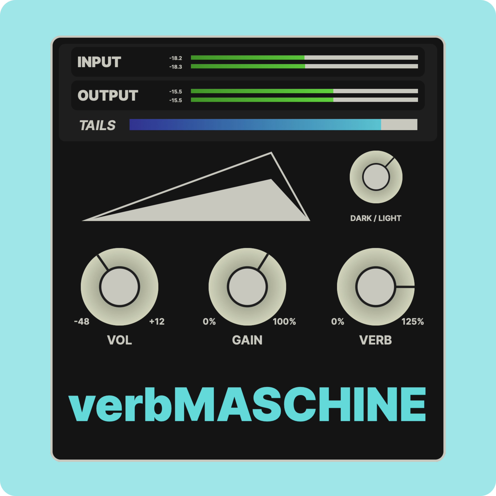

# verbMASCHINE

> A fuzzy, ambient reverb plugin in VST & AU formats.

## Install

[Click here](https://github.com/SomeOtter/Dracula-Ableton-Live-12/archive/master.zip) to download the theme as a ZIP file.

[Click here](./INSTALL.md) for installation instructions.

## Color Palette

To accomodate Ableton's extensive range of UI elements, this theme uses an extended colour palette derived from the original dracula theme.

## Team

This theme is maintained by the following person(s) and a bunch of [awesome contributors](https://github.com/dracula/abletonlive12/graphs/contributors).

 |
--- |
[SomeOtter](https://github.com/SomeOtter) |

## Community

- [Twitter](https://twitter.com/draculatheme) - Best for getting updates about themes and new stuff.
- [GitHub](https://github.com/dracula/dracula-theme/discussions) - Best for asking questions and discussing issues.
- [Discord](https://draculatheme.com/discord-invite) - Best for hanging out with the community.

## License

[MIT License](./LICENSE)
